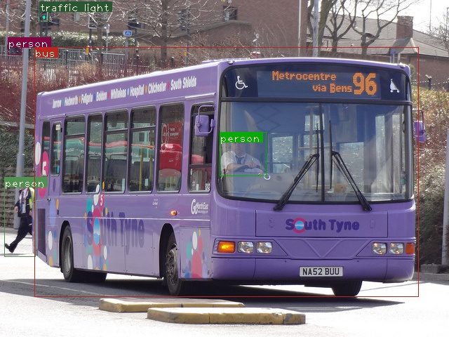
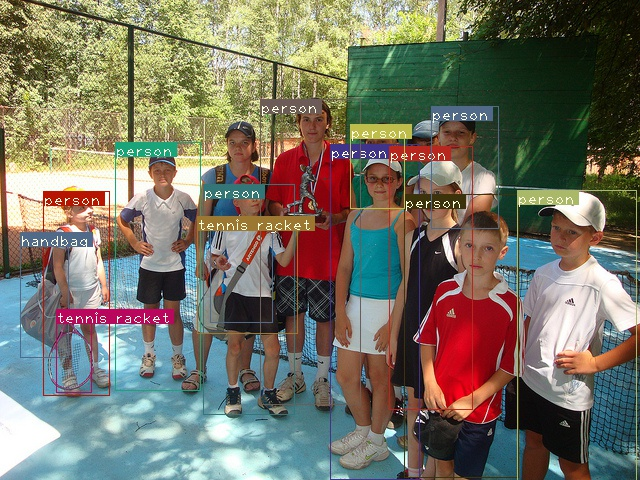
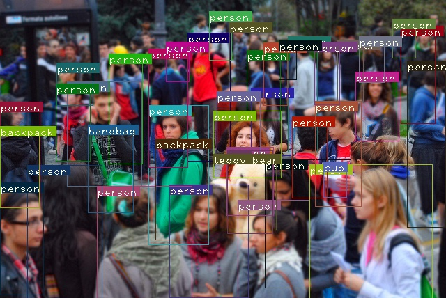

# Object-Detection

This code uses Python and Pytorch to classify and localize up to 80 objects in images or real time video. 

Implemented Algorithms:
- YoloV3  
- Single Shot Detection 
- Faster R-CNN 

Sample Output:

YOLOV3
----------------------------------------------------------
SUMMARY
----------------------------------------------------------
Task                     : Time Taken (in seconds)

Loading Network          : 2.959
Reading Images Directory : 0.001
Loading batch            : 0.246
Detection (11 images)    : 2.493
Drawing Boxes            : 0.473
Average time_per_img     : 0.227
----------------------------------------------------------

